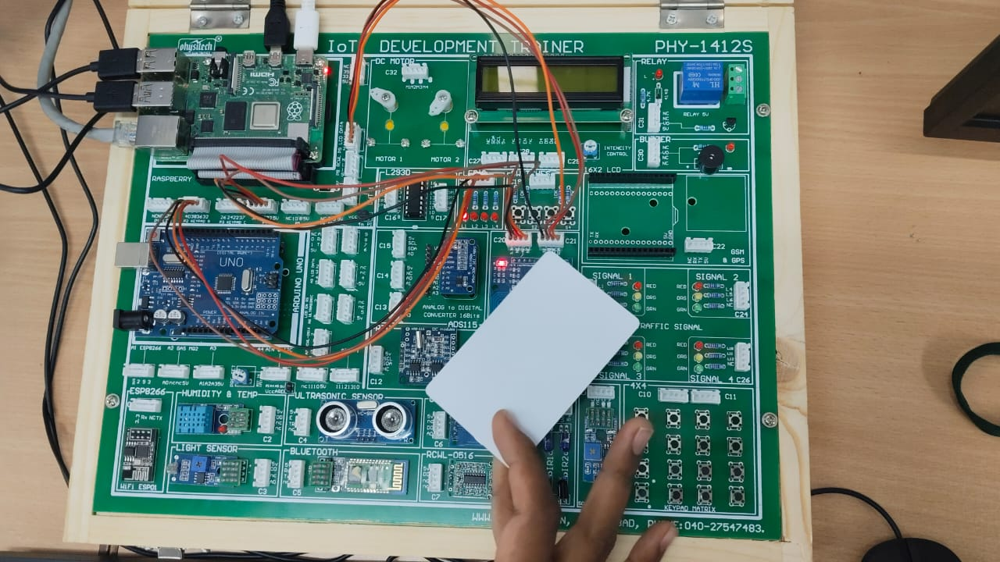
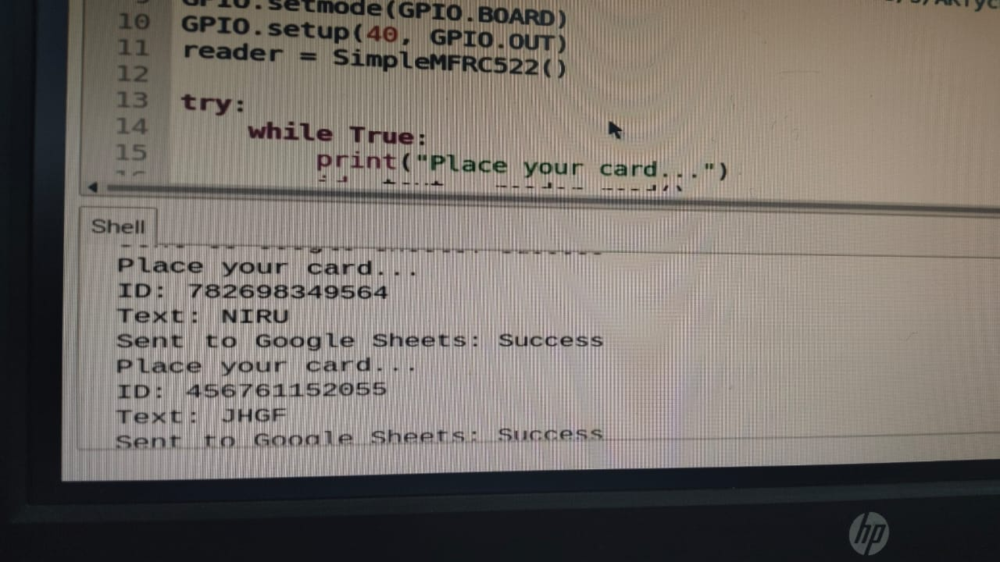
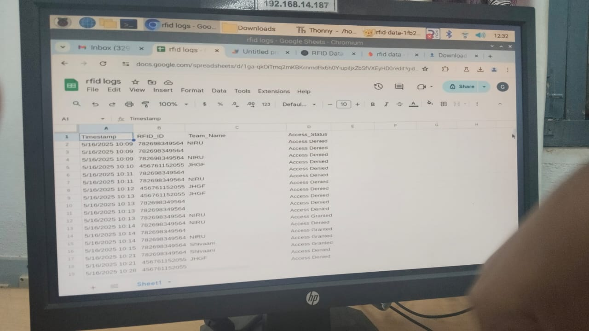

# RFID Google Sheets Logger

This project is an RFID-based access control and logging system using a **Raspberry Pi** and **Google Sheets** via a Web App.

## 🔧 Features

- Scans RFID cards using MFRC522
- Identifies users based on ID + Name
- Controls GPIO output (LED or relay)
- Sends data (ID, name, access status) to a live Google Sheet
- Stores attendance or access logs remotely

## 📷 Project Photos

> Located in `/photos` folder

| Circuit Setup        | Login RFID Scan         | Google Sheet Output     |
|----------------------|--------------------------|--------------------------|
|  |  |  |

## 💻 Tech Used

- **Raspberry Pi** (any with GPIO)
- **MFRC522 RFID Reader**
- **Python 3**
- **Google Apps Script Webhook**
- Python Libraries: `RPi.GPIO`, `mfrc522`, `requests`

## 📝 How It Works

1. Waits for an RFID card to be scanned.
2. Checks if the card UID and name match known users.
3. Turns on GPIO pin 40 (access granted) or off (access denied).
4. Sends the result to a Google Sheet through a Webhook URL.

```python
payload = {
    'rfid_id': str(id),
    'team_name': team_name,
    'access_status': access_status
}
requests.post(WEBHOOK_URL, json=payload)
